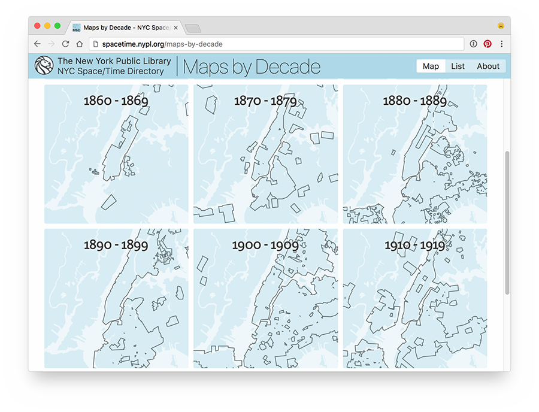

# Group Maps

Group Maps selects a subset of [Map Warper](http://maps.nypl.org/warper/) maps from the [NYC Space/Time Directory](http://spacetime.nypl.org), and groups them in bands of a configurable amount of years.

From a Map Warper dataset file, Group Maps creates two GeoJSON files, one with all the maps, and one containing one Feature per group.

Group Maps uses [Turf](http://turfjs.org/) to do geospatial intersection and union operations.

Example of [Map Warper maps of New York City, grouped by decade](http://spacetime.nypl.org/maps-by-decade):

[](http://spacetime.nypl.org/maps-by-decade)

## Installation & Usage

- Install Group Maps:

    npm install nypl-spacetime/group-maps

- Download the Map Warper objects NDJSON file from the NYC Space/Time Directory's data repository:

    wget http://s3.amazonaws.com/spacetime-nypl-org/datasets/mapwarper/mapwarper.objects.ndjson

- Create a [configuration file](#configuration), or use [`maps-by-decade.config.js`](maps-by-decade.config.js).

Group Maps exposes one function:

```js
const groupMaps = require('spacetime-group-maps')
const geoJSONStreams = groupMaps(pathToNDJSON, config)
```

- Input:
  1. path to NDJSON file containing Map Warper maps
  2. configuration object, [see below](#configuration)
- Output:
  - Object containing wwo [Highland streams](http://highlandjs.org/), `all` and `grouped`; containing GeoJSON data

### Example

```js
const groupMaps = require('spacetime-group-maps')

const config = require('./maps-by-decade.config.js')
const pathToNDJSON = 'mapwarper.objects.ndjson'

const geoJSONStreams = groupMaps(pathToNDJSON, config)

geoJSONStreams.all.pipe(fs.createWriteStream('./maps-by-decade.all.geojson'))
geoJSONStreams.grouped.pipe(fs.createWriteStream('./maps-by-decade.grouped.geojson'))
```

See the [Group Maps ETL module](https://github.com/nypl-spacetime/etl-group-maps) for a complete example on how to use Group Maps.

## Configuration

```js
module.exports = {
  groupBy: (object) => {
    // Group maps using the following value
    const getDate = (str) => new Date(`${str}`)
    const bandSize = 10
    const validSince = object.validSince
    const validUntil = object.validUntil
    const year = (getDate(validSince).getFullYear() + getDate(validUntil).getFullYear()) / 2
    return Math.floor(year / bandSize) * bandSize
  },

  properties: (object) => ({
    // Only copy the following properties to GeoJSON Features in output
    id: object.id,
    uuid: object.data.uuid,
    imageId: object.data.nyplDigitalId,
    name: object.name,
    year: object.validSince
  }),

  // Only use maps intersecting with this GeoJSON geometry
  geometry: {
    type: 'Polygon',
    coordinates: [
      [
        [
          -73.424377,
          40.436495
        ],
        [
          -73.424377,
          41.15591
        ],
        [
          -74.347229,
          41.15591
        ],
        [
          -74.347229,
          40.436495
        ],
        [
          -73.424377,
          40.436495
        ]
      ]
    ]
  },

  // Only use maps published in this year, or newer
  yearMin: 1850,

  // Only use maps published in this year, or older
  yearMax: 1949,

  // Only use maps depicting an area of this amount of square meters, or more
  minArea: 0

  // Only use maps depicting an area of this amount of square meters, or less
  maxArea: 5000000,

  // Buffer around grouped polygon, in meters
  buffer: 25,

  // Tolerance of simplification function; see http://mourner.github.io/simplify-js/
  simplifyTolerance: 0.00005
}
```

## Examples:

- [Maps by Decade](http://spacetime.nypl.org/maps-by-decade) - https://github.com/bertspaan/maps-by-decade
- [Along the Hudson](http://bertspaan.nl/along-the-hudson) - https://github.com/bertspaan/along-the-hudson
